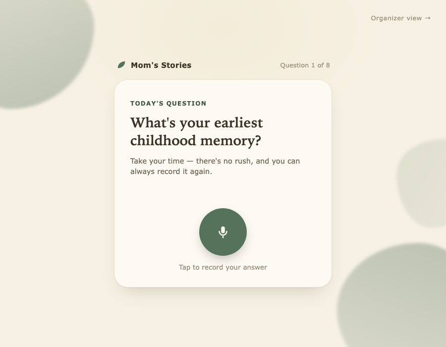
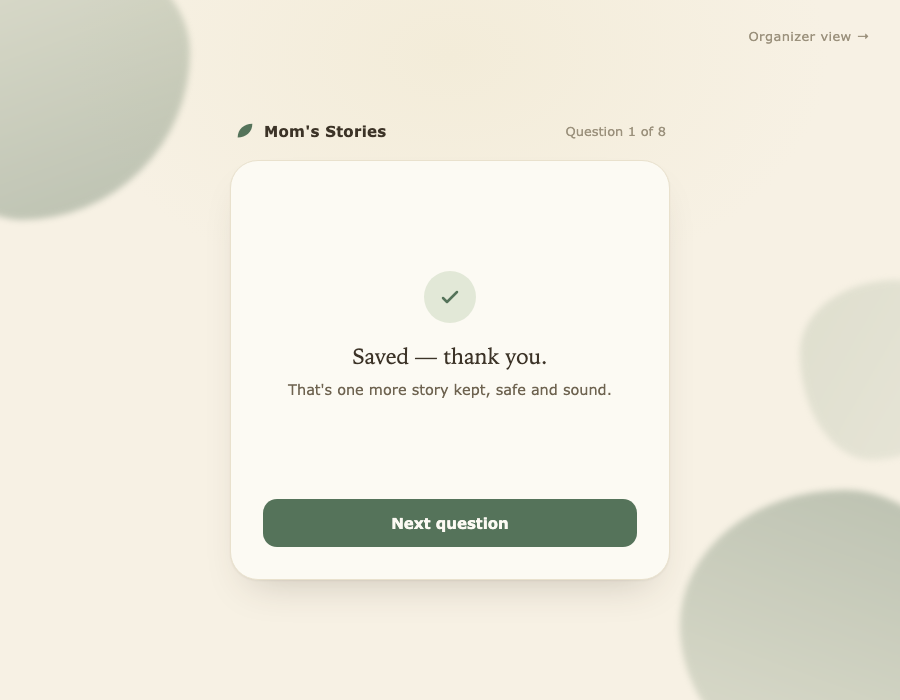
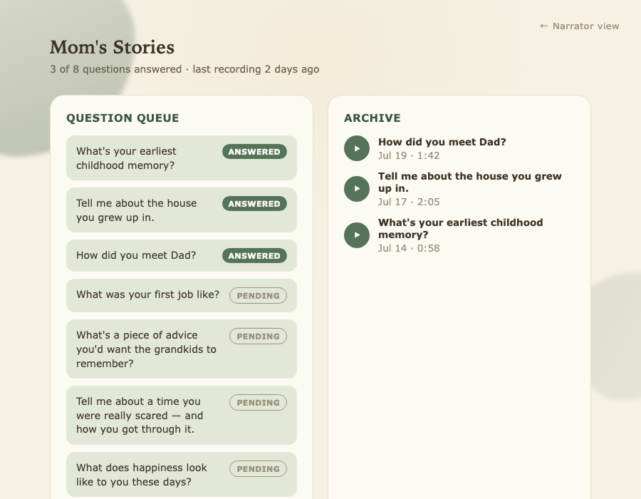
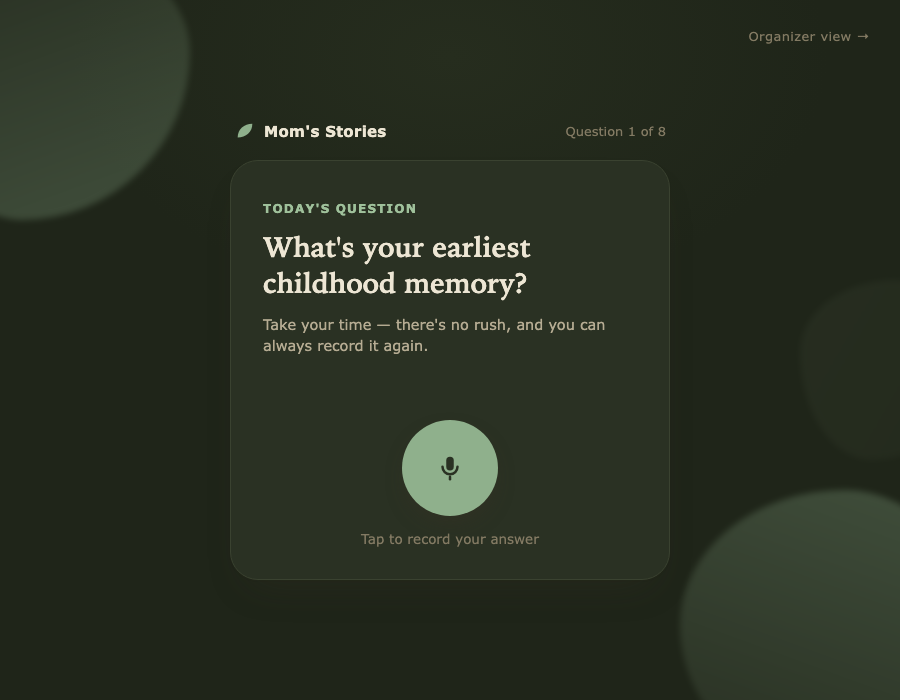

# Family Story

A voice-first way for parents and grandparents to record their life stories, one question at a time — so their kids end up with an actual book of who they were, not just memories that live in one person's head.

**[Live demo →](https://larkindom.github.io/family-story/)**

## The problem

Older adults carry decades of stories that exist only in memory. Their kids want those stories preserved, but the tools that exist today (Storyworth, Remento) are subscriptions built around print books, email cadences, and infrastructure that costs money whether or not anyone uses it — and none of them connect *multiple* family members' stories together.

Family Story is designed to be lighter than that: no login, no app install, one big button, one question at a time. Built for someone who has never used a smartphone app before.

## What's in this repo

This is a curated showcase, not the full source. It includes:

- **A clickable UX demo** (this page) — a static HTML/CSS/JS mockup of the narrator recording flow and the organizer dashboard, fully interactive, no backend required.
- **Screenshots** of the actual working prototype below, which is a real app: React, Vite, Tailwind, and shadcn/ui on the frontend, with a Node/Express backend, a real database, and real microphone recording.

It does not include the working prototype's source, backend, data model, or the planned AI pipeline design — those stay private. That's also why this repo shows up as 100% HTML on GitHub: the demo page here is a hand-built visual stand-in, not the real React app.

## Screenshots

**Recording a story**

**After answering**

**Managing the family** — a sidebar for the people being recorded, with each person's own question queue and archive

**Same room, evening light** — theming isn't a naive dark-mode inversion; it's meant to feel like the same room at a different time of day

## How it works (high level)

- The person telling their story gets **one personal link** — no account, no app. It shows one question, one big record button, nothing else.
- Whoever's organizing the family (a kid, usually) gets a **sidebar dashboard**: add or remove the people being recorded, note how they relate to each other, switch between people to see each one's own question queue, and browse everyone's answers as they come in.
- Each storyteller only ever sees their own questions — the family management layer is invisible to them.

The working version behind these screenshots has real microphone recording, real audio storage, and a real database — none of that is included here.

## Design

The visual direction: a warm, sunlit room with plants — eggshell white, soft greens, a warm serif for questions paired with a rounded sans for the interface, built for a first-time smartphone user with large tap targets and no clutter.

---

© Larkin Domench. Shared here as a portfolio piece — no license is granted to copy, reuse, or redistribute this code.
